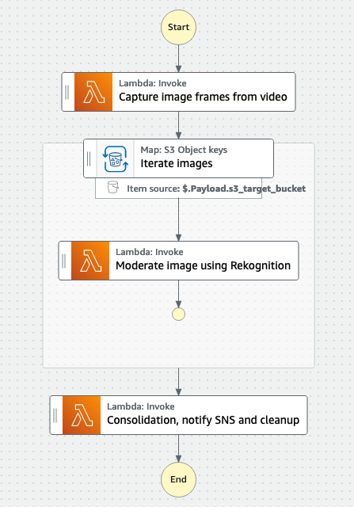

# Rekognition Video Moderation - image sampling solution

Amazon Rekognition is an AWS AI service that offers pre-trained APIs to support image and video moderation. 

One approach to moderate videos is to model video data as a sample of image frames and use image content moderation models to process the frames individually. 
For more information about Rekognition video moderation comparision, refer to [this blog post](https://aws.amazon.com/blogs/machine-learning/how-to-decide-between-amazon-rekognition-image-and-video-api-for-video-moderation/) which compares the image and video APIs in terms of accuracy, cost, performance and architectural complexity.

This repo contains two solutions to help you to implement video moderation using Rekognition image API. 
Both solutions offer a similiar interface as the Rekognition Video moderation API. 
So you can easily replace your logic to switch to Image moderation API.

### All-in-one Lambda function
The Lambda function manages the below logical steps in one place:
1. Download the video from the S3 bucket to the local disk
2. Sample images from the video based on a given interval using ffmpeg (default interval: 2 frames per second)
3. Store the images in S3 bucket in a temperate folder
4. Call Rekognition Image API to moderate the image frames
5. Consolidate the result to the Rekognition Video moderation API response format
6. Send the result to an SNS topic (if provided)

You can call this Lambda function from your existing code by invoke it in async mode as below:
```
import boto3
lambda = boto3.client("lambda")
lambda.invoke_async(
    FunctionName='string',
    InvokeArgs=b'bytes'|file
)

```
This solution is light to deploy but may timeout if the video is too long, with a high resolution, and requires to sample the video in a high frequency.

### Step Functions + Lambda
This solution uses Step Functions state machine to orchestrate Lambda functions. 
It prevents the timeout issue could happen in the first single Lambda function solution, as the workflow will iterate through the sampled images and call a Lambda function one by one.
It is ideal for use cases when you need to moderate large videos in a high frequency.


Invoke Step Functions state machine using Boto3
```
import boto3
sfn = boto3.client('stepfunctions')
sfn.start_execution(
    stateMachineArn='string',
    name='string',
    input='string',
)
```

### Install environment dependencies and set up authentication
<details><summary>
:bulb: You can skip this section if using CloudShell to deploy the CDK package or the other AWS services support bash command from the same AWS account (ex. Cloud9). This section is required if you run from a self-managed environment such as a local desktop.
</summary>

- [ ] Install Node.js
https://nodejs.org/en/download/

- [ ] Install Python 3.7+
https://www.python.org/downloads/

- [ ] Install Git
https://github.com/git-guides/install-git

- [ ] Install Pip
```sh
python -m ensurepip --upgrade
```

- [ ] Install Python Virtual Environment
```sh
pip install virtualenv
```


- [ ] Setup the AWS CLI authentication
```sh
aws configure                                                                     
 ```                      
</details>

### Deploy the CDK package

1. Clone code
```sh
git clone https://github.com/lanazhang/aws-rekognition-video-moderation-image-sampling
```
```sh
cd aws-ai-cm-rek-img-accuracy-eval-cdk/
```

2. Install Node CDK package
```sh
sudo npm install -g aws-cdk
```

3. Create Python Virtual Environment
```sh
python3 -m venv .venv
```

4. Activate virtual environment

  - On MacOS or Linux
  ```sh
  source .venv/bin/activate
  ```
  - On Windows
  ```sh
    .venv\Scripts\activate.bat                                        
```

5. Once the virtualenv is activated, you can install the required dependencies.

```
pip install -r requirements.txt
```

6. Set up environment varaibles - change the values to your target AWS account Id and region.
```
export CDK_DEFAULT_ACCOUNT=[YOUR_ACCOUNT_ID]
export CDK_DEFAULT_REGION=[YOUR_TARGET_REGION]
```

7. Bootstrap CDK
```
cdk bootstrap aws://${CDK_DEFAULT_ACCOUNT}/${CDK_DEFAULT_REGION}
```

8. Deploy CDK package
```
cdk deploy --all --requires-approval never
```
